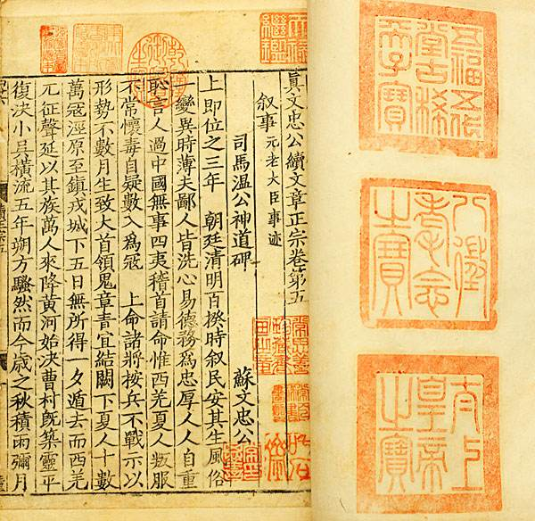
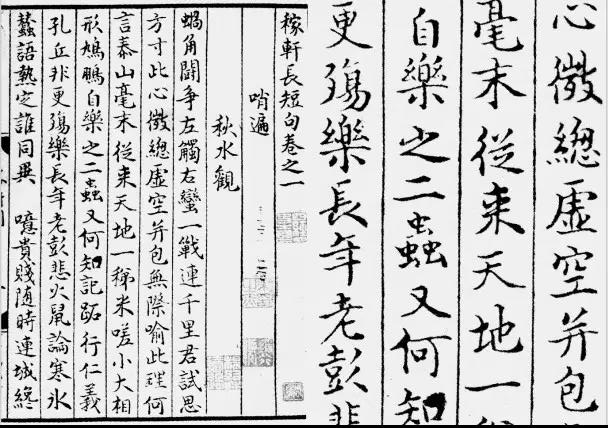
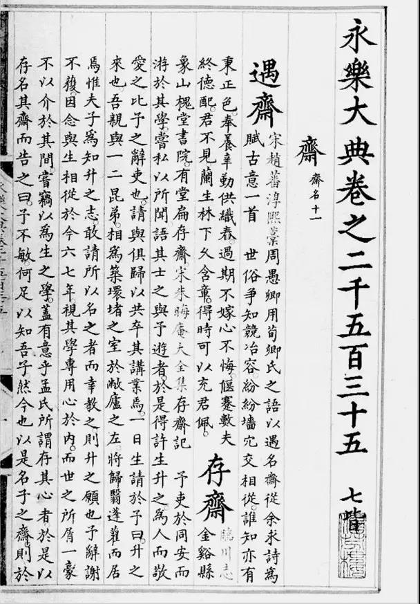
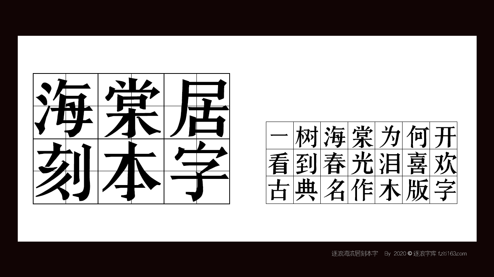
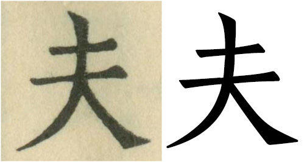
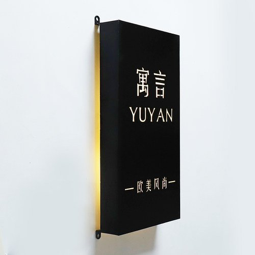
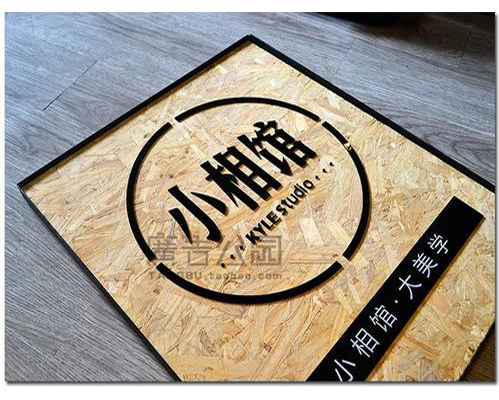
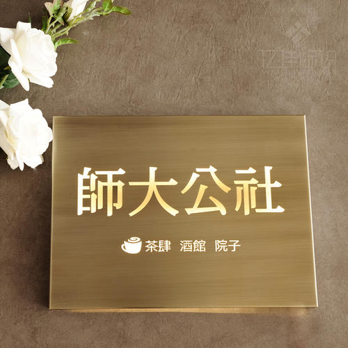

# 为有善本刻成书-从逐浪书海棠居书刻本字探秘中国古代刻本用字及出版特点研究

作者：汪洋  易子房（逐浪字库团队）

<!-- TOC -->

- [为有善本刻成书-从逐浪书海棠居书刻本字探秘中国古代刻本用字及出版特点研究](#为有善本刻成书-从逐浪书海棠居书刻本字探秘中国古代刻本用字及出版特点研究)
    - [中国人的出版情结](#中国人的出版情结)
    - [宋辽金元明清六代刻本特色分析](#宋辽金元明清六代刻本特色分析)
        - [辽刻本](#辽刻本)
        - [金刻本](#金刻本)
        - [元刻本](#元刻本)
        - [明刻本](#明刻本)
        - [清刻本](#清刻本)
    - [当代刻本字的学术研究与生产构建](#当代刻本字的学术研究与生产构建)
        - [民国时期](#民国时期)
        - [建国后](#建国后)
        - [进入新世纪，尤其是21世纪20年代](#进入新世纪尤其是21世纪20年代)
    - [应用背景](#应用背景)
        - [中文字库古籍字体的未来发展](#中文字库古籍字体的未来发展)
        - [应用方向](#应用方向)
        - [逐浪书刻体小析](#逐浪书刻体小析)

<!-- /TOC -->

## 中国人的出版情结

提到出版，中国人都会提到四大发明，分别是：
- 印刷术
- 火药
- 指南针
- 造纸术

其中印刷术与造纸术，都是围绕着出版行业。

早在西汉，《报任安书》中，就有这样的文字：
>古者富贵而名摩灭，不可胜记，唯倜傥非常之人称焉。盖文王拘而演《周易》；仲尼厄而作《春秋》；屈原放逐，乃赋《离骚》；左丘失明，厥有《国语》；孙子膑脚，《兵法》修列；不韦迁蜀，世传《吕览》；韩非囚秦，《说难》《孤愤》；《诗》三百篇，此皆圣贤发愤之所为作也。此人皆意有所郁结，不得通其道，故述往事、思来者。乃如左丘无目，孙子断足，终不可用，退而论书策以舒其愤，思垂空文以自见。
仆窃不逊，近自托于无能之辞，网罗天下放失旧闻，略考其行事，综其终始，稽其成败兴坏之纪，上计轩辕，下至于兹，为十表，本纪十二，书八章，世家三十，列传七十，凡百三十篇。亦欲以究天人之际，通古今之变，成一家之言。草创未就，会遭此祸，惜其不成，是以就极刑而无愠色。仆诚以著此书，藏之名山，传之其人，通邑大都，则仆偿前辱之责，虽万被戮，岂有悔哉？然此可为智者道，难为俗人言也！

而后，东汉许慎《说文解字》则将书的意义提升到了更高的理论层级。

即使在当代，通过淘宝筹款出书、以及民间宗谱制造事业，依然层出不穷，可见中国人对出版著书的关心和热忱。

中国古代的出版，主要分雕版印刷术、活字印刷术、篆刻等类型。

由于活字印刷需要技巧较高，而古代封建集权时代，对于书籍出版有一个字的“官方制版--认证--民间刊印”过程，如同今天的电影拷贝需要认证才能公映一样。

在普罗大众中，书籍印刷需要低成本、高保真、统一制式的发行，雕版印刷无疑是最好的方法。

这就造成了雕版印刷术是最受普罗大众喜爱的一种出版形式。

后人对雕版印刷术的称呼，有人称为：雕版、也有人称为刻本、以及称为书刻，概而言之，基于统一的刻本的创作。

现多数学者认为雕版印刷术初始于唐代，也有人认为是始于隋代，行于唐世。

隋唐两代相传，不影响学术的研究。

史料关于唐代民间刻书卖书记载甚多，五代冯道令国子监雕印“九经”，是官府刻书之始。宋代雕版印书风行，有官府刻书、家塾刻书、书商刻书。元、明迄清，虽出现木活字、铜活字等多种活字印刷，雕版始终居于优势，并发展了彩色雕版套印技术。早期的雕版印刷工艺十分简陋，一般只是单页小型的印刷品，如一首诗、一幅图画等，后来随着雕版印刷工艺水平的提高，才出现了印刷大篇幅的印刷品。流传下来的刻印古籍，有的没有序跋，或者虽有序跋而未署年代，版心也未刻写刻工姓名，亦不见藏家著录。在刻本也大致分为宋刻本、辽刻本、金刻本、元刻本、明刻本、清刻本。

## 宋辽金元明清六代刻本特色分析
   ### 宋刻本
 1. 北宋早期刻书多用欧体字，后来逐渐流行颜体。南宋以后，柳体字日趋增多。从地区刻本看，汴梁和浙本多欧体，蜀本多颜体，闽本多柳体，江西本欧柳间而有之。
　　自明代中后期以来，宋刻本一直受到学者、藏书家的特别重视。到了明朝，宋刻本尤其是善本已值一页千金。据统计，今天在整个中国所能找到的宋刻本，总量不会超过1200部，多数已被定为国家一级文物，只集中在少数几家大型图书馆，遗失民间的极少。其中，中国国家图书馆藏有500余部，北京大学图书馆150余部，上海图书馆200余部。
　　宋版之美主要在于字体、版式。事实上，从现存临潼区图书馆中的西山先生真文忠公读文章正宗二十卷（图1） 的雕刻技术来看，印刷术已相当成熟。从目前留存的北宋版和南宋版中的名品看，几乎都出自擅长书法的人之手。宋本用墨精良，一般浓厚似漆，刀法精致认真，字画丝毫不苟，不失原来书写手笔神韵.
  
图1 西山先生真文忠公读文章正宗二十卷

### 辽刻本
  1. 辽刻的书，传本极少。究其原因乃是辽国书禁很严，“有将书传入中国者，法皆死”。故辽刻在古籍收藏中极为珍贵。
  2. 辽刻《大藏经》，亦称《契丹藏》，很有名。后高丽刻《大藏经》，即由《契丹藏》出。今《高丽藏》尚有存者，根据《高丽藏》，亦可略知《契丹藏》的梗概。 
  3. 近年山西应县木塔发现辽代刻本、写本经卷和佛画多件，还有最早的刻本《蒙求》。
### 金刻本
1. 金刻本流传于世的比辽刻的多，因金人无禁书出国之律。金刻的中心地区只有平水县一处。平水在今山西境内，地处偏僻，兵事难以波及，故有坊刻行世。
2. 平水书坊著称于世的，有晦明轩，南宋宁宗嘉泰四年(1204年)，刻《经史证类大观本草》三十卷，南宋宁宗开禧二年(1206年)，刻《丹渊集》四十卷、《拾遗》二卷、《附录》一卷；又有中和轩，南宋理宗绍定五年(1232年)，刻《道德宝章》一卷。
3. 此外金刻有《孔氏祖庭广记》、《李贺歌诗编》四卷、元好问编《中州集》十卷、吴兢《贞观政要》；北京图书馆藏有《周礼注》十二卷，《释音》一卷，《新修累音引证群籍玉篇》三十卷，《壬辰重改证吕太尉经进庄子全解》十卷（宋吕惠卿撰），《栖霞长春子丘神仙磻溪集》三卷（金丘处机撰），《南丰曾子固先生集》三十四卷，《刘知远》十二卷。
4. 据《萧闲老人明秀集注》《南丰曾子固集》《玉篇》和《集韵》(北京图书馆藏)来看，字体近于柳，字画结构瘦俏有神，起落顿笔，横轻竖重，结构抗肩，颇似魏《张猛龙碑》字体。
### 元刻本
1. 元代刻书字体，初期犹有晚宋和平水遗风，字体也接近。赵孟頫仕元后，其书法隽美秀逸，为世所重，临摹赵字成为风气。刻书字体也不例外，也有的是在欧体的基础上加进赵体的成分，结构和点画更流动、灵活。岳氏《九经》仿宋刻本的欧体字却更肥重。也有特例，江西南丰丁思敬刻《元丰类稿》，渗入颜体字的味道。还有用行书的，如日新堂刻《伯生诗续编》，广信书院本《稼轩长短句》（图2）等带有行书味。元刻本字体仍用颜体，却比南宋时刻本的字瘦一些、圆劲一些。话本、杂剧也用颜体，但比较粗率。元平水本的字体比金平水本更近颜体，更挺拔。大多刻的《歌诗编》却是欧体字，接近蜀刻小字本的字体。另外，元刻本中多简体字和俗字，官刻、家刻中较少，经史文集中较少，坊刻和话本类书中较多。
  
图2　广信书院本《稼轩长短句》

### 明刻本
1. 明代刻书机构比唐、五代、宋、金、元更多，是中国出版事业和印刷技术发展的极盛时代。官刻本中有内府本（包括经厂本）、国子监本以及其他中央机构和地方官刻的书帕本，还有介于官刻和家刻之间的藩府本。
2. 明代各时期刻书略有不同，前期黑口白绵纸，中期白口仿宋字，后期白口长字避讳，前后期变化较大。
3. 明中叶是指正德、嘉靖、隆庆和万历前期。屈万里和昌彼得先生在《图书版本学要略·鉴别篇》中说：“正德中叶以后，覆刻宋本之风渐盛。”明中叶时期的字体，不论是复刻或者新雕，都极力仿南宋的浙本，改用欧体，但又和南宋的浙本不一样。南宋浙本的欧体是书写体，很逼真，从艺术上讲似乎比嘉靖的方板整齐要美观一些。

### 清刻本
1. 清刻本分为官刻本、家刻本和坊刻本。其中官刻本即内府本，刻书多为殿本，校刻精致，纸墨上佳，堪与宋刻本相媲美。清初期刻本，字体仍是明代末期的风格，字形长方，直粗横细。清代刻本的装帧形式，最通用的是包背装和线装，宫廷刻书兼有经折装、蝴蝶装和包背装。现今流传的古籍大部分是清刻本。其中，乾隆前后所刻精刻本受到学者重视，有不少被列为善本。
2. 明清两代，藏书家以抄书为业的很多，往往竭尽平生精力，互相假借传抄，手校眉批丹黄满卷。这样的书，不但文字内容足可珍贵，即其手迹亦颇见重于世，凡得之者，无不视为善本。明代抄本，纸张墨色和刻本相同。印格的颜色，除《永乐大典》（图3）用朱画格外，一般多为墨格；万历以后则多用蓝格或红格。如在故宫博物院所见傅增湘旧藏明抄本《新刊监本册府元龟》，存250册。竹纸，蓝格，半叶11行，行24字，四周双边，白口。《文苑英华》残存25册。白棉纸，蓝格，半叶12行，行22字。字体不完全一律，但都自然流利，有的颇有《永乐大典》韵味。
  
图3　《永乐大典》

## 当代刻本字的学术研究与生产构建

计算机时代，如何实现刻本字的文化传承，是一个新的课题。

进入20世纪以来，刻本字涌出了几个高潮。

### 民国时期
工业时代文明，催生出了一代的铅刻本字，以上海、广州为中心传播。

### 建国后
以上海字研厂为中心，发展新刻本字（可于www.ziti163.com字体网搜索“字研”、“上海”等关键字）查看

### 进入新世纪，尤其是21世纪20年代

当代刻本字出版，在中国大陆地区，涌现出了一批积极的厂商。

其中包括：逐浪字库，其出品的“海棠居刻本字”，以古代徽州善本、湖南茶陵刻本为基础，其中包括婺源朱氏、湖南阳明学派书系文本为基础，进行了大胆的创新。。。

其它包括方正、汉仪有一定的尝试。

## 应用背景
### 中文字库古籍字体的未来发展
1.  古籍、刻本字体在现实生活中越来越常见了。哪怕你不经常逛书店，饭店菜单、电影电视剧海报、接头散发的广告单，都可以经常看到他们的身影。我个人将国内古籍、刻本字体分为两类：一类追求旧时代字体风格特征，同时适合现代印刷排版的，如方正清刻本悦宋、方正宋刻本秀楷；另一类，忠实还原善本中刻字形态的数码轮廓字体。大众对字体设计的需求不会拘泥于一种或者几种设计风格，所以字库厂商还需要设计出满足不同层次受众的字体。于此同时，相较于“宋黑仿楷”这四类传统字体，目前古籍、刻本字体种类较少，未来中文字库在古籍字体设计方面还有很大发展空间。
2.  为适应现代印刷排版需求，设计古籍、刻本字体，简单的复制原有字形可能效果并不理想。再如，哪怕设计者一心想忠实原版，百分之百复刻原有字形，这也是相当困难的。如下（图4）某书刻字体是依照《攻媿先生文集》与《毛主席诗词三十七首》中的字形设计而来的，当把文集拿来，用高清扫描仪扫描放大，在电脑上逐一查看细节，效果就是下面这个样子。两条横划均存在墨迹不匀，边缘不清晰的现象，笔划交叉处交代不清楚，撇捺似乎有墨迹晕染加粗的嫌疑，如何做修改，这也是见仁见智的事情，不同设计师数码化字形轮廓的结果自然会不尽相同。
  
（图4） 左为《毛主席诗词三十七首》中的“夫”字   右为某书刻字体
3. 此外，古籍刻本中的字，虽然旧笔形字居多，要想制作满足现代繁体字编码要求的字库，也会经常遇到字不全的现象，而设计简体字编码的字库，缺字的困扰则更加严重，设计师只得重新设计缺失笔画，搭建出具有古籍神韵的简体字形。

### 应用方向
1. 现在的文字，无论是那种类型的，基本都是为广告设计而设计的，完全没有古人创字时的睿智。城然，我们在了解一家店的时候，第一印象就是招牌字体设计上面描述的框架内容，了解店家的经营服务项目，所以招牌字体设计具有很强的代表性。
  
  
  
有一块醒目的招牌,那么路过的人们就会很快记住你的店，排版固然重要，但是没有相对应的字体衬托无疑也是失败的。现如今，人们似乎对于刻本字体情有独钟，或许深知每一个字都蕴含着制作者的情感，在这个急剧发展的时代，很多产品都来自机械化的生产，因此，一些类似手工制品的的产品更加显得珍贵。  

### 逐浪书刻体小析
  

元版多用赵孟頫体，
明代前期则沿袭元而多用赵体；中期则是仿宋，即仿照前述宋代刻书的硬体，横轻竖重，笔画硬直，结构方整的匠体字；
晚期则字形变长。
清代康熙、乾隆多写刻本，而硬体则前期基本沿袭明代，后期则字形略为圆滑、小气。
目前我们所见到的《康熙字典》的字头，即是软体的楷书字。

逐浪海棠居刻本字是一款仿古的刻本文字，以楷书为表现形式，
创作原则：
勾画，最后收笔上平，尖点切去锐角，符合雕版制作工艺风貌。
横竖交接处，有较尖锐的隼卯结构。
细横，较参照字粗两个单位。
多有切角，每字有1-2笔又保留尖角。
求平和，不要陡峭，如“浙江民间书刻体”之“七”字勾处收笔峭峻逼人，非良字也。

来自江南名家海棠居精心创作，做到每一笔都有灵魂与精神。
