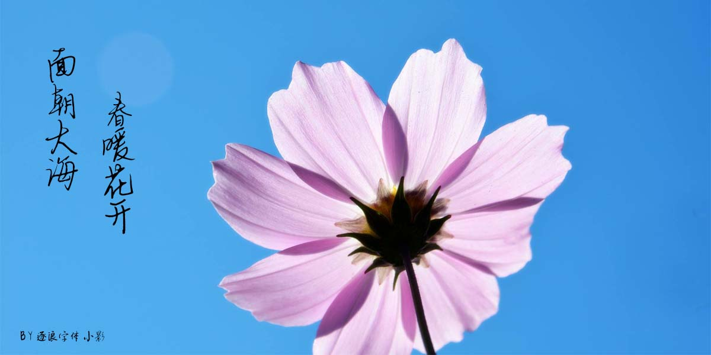
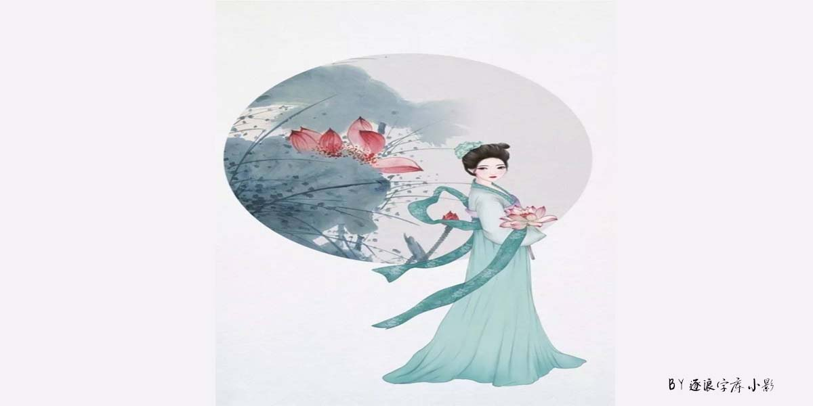
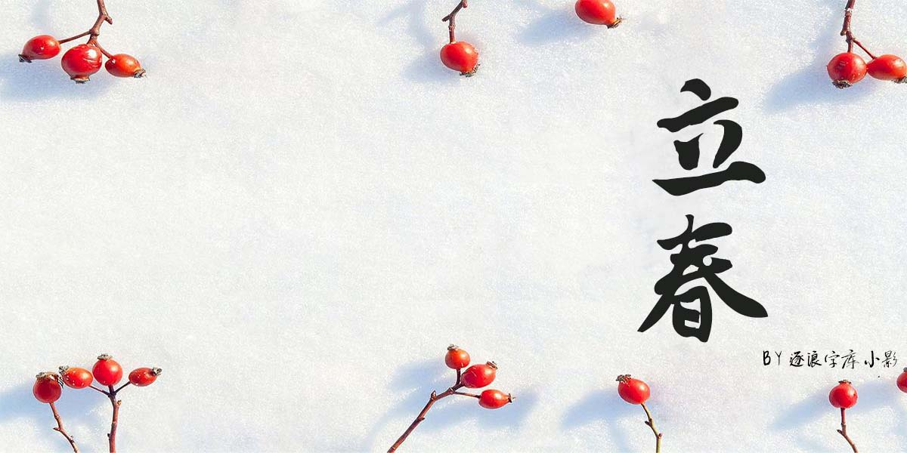
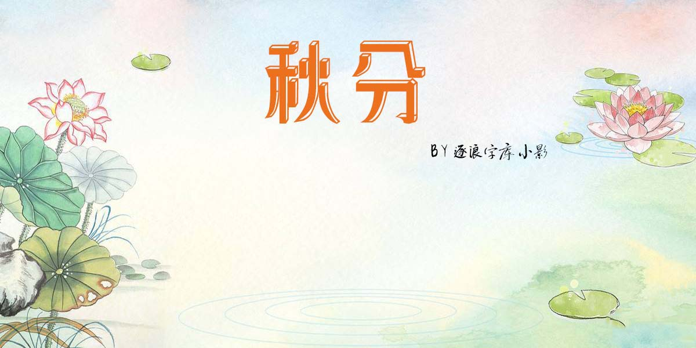
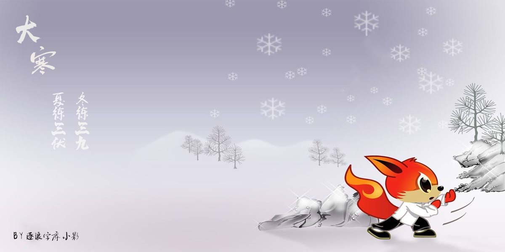

 **二十四节气与中国汉字关系的研究与逐浪字库的精彩展示**
 
作者：小影
创作时间：2020年3月21日

<!-- TOC -->

- [一、 二十四节气的来历](#一-二十四节气的来历)
- [二、 二十四节气中的谚语文化](#二-二十四节气中的谚语文化)
- [三、 二十四节气中的诗词文化](#三-二十四节气中的诗词文化)
- [四、 结语](#四-结语)

<!-- /TOC -->

 # 前言

&emsp;&emsp;二十四节气是我国劳动人民长期对天文、气象、物候进行观测、探索、总结的结果，它能反映季节的变化，指导农事活动，影响着千家万户的衣食住行，是我国劳动人民独创的文化遗产。在二十四个节气背后，蕴含着鲜明的中华民族传统习俗和深厚的文化积淀，有关二十四节气的诗词曲赋，无不鲜明地带有中华民族的传统特色，成为我国农耕文化重要的组成部分。二十四节气与我国出自我国民间农耕传统文化，与传统文化有着千丝万缕的渊源。二十四节气不仅承载着天文气象、农桑工艺、自然博物、幼学算术、饮馔养生等传统知识和民间智慧的代际传承，同时也是信仰禮仪、诗词歌赋、说唱戏文、时令谚语、民间美术、棋艺书画等文化表达形式得以广泛传播的重要载体，更是当代中国人文化创造的灵感源泉。尤其在追求“生产、生活、生态”三生共赢、力求建设美丽中国的今天，二十四节气所蕴含的古老智慧深有价值。从人与自然的合契参同，到人与社会的和谐发展，二十四节气不仅培育了中国人尊重自然规律和生命节律的世界观，也塑造了天道均平、兼容并蓄、以和为贵的生活理想。

# 一、 二十四节气的来历
&emsp;&emsp;在春秋战国时期，人们已经能够使用一个竹竿子进行太阳影子长短的测量，由此来确定四季交替节气的到来，如春分、秋分、夏至和冬至。在一年当中，夏至时分，正午影子最短的一天是夏至，最长的是冬至，长度正好为秋分和春分。后来一直发展到秦汉，就有了非常完整的二十四节气的概念。若是从天文的角度分析，二十四节气就是对太阳变化顺序的研究，然后把全年进行不同程度的划分，给每一个节气都取一个与时令相关的名字，这就是二十四节气。其和温度、降水有着非常大的关联性，因此人们使用二十四节气来确定农耕的时期。在民间有关二十四节气的诗词歌赋还有很多，从另外一个层面上分析其文化历史地位不可代替人们为了识记得更加清楚还在民间编纂了歌谣：“春雨惊春清谷天，夏满芒夏暑相连;秋处露秋寒霜降，冬雪雪冬小大寒。上半年是六廿一，下半年来八廿三，每月两节日期定，最多相差一二天。”

# 二、 二十四节气中的谚语文化
&emsp;&emsp;谚语也是我国文化的一种，具有千年的历史记载，无论是《左转》还是《国语》抑或是《史记》当中都有谚语的记载，后来到了宋代还出现了谚语专著即《古今谚》。我国古代是发达的农业国家，民谚民谣的产生主要是劳动人民为了让生产生活更加便捷，这些民谚形式是多种多样的，具有非常生动的属性，活泼，意象鲜明。“小暑惊东风，大暑惊红霞”“大暑大落大死，无落无死”等等，谚语短小精炼，也非常实用和具体，一直在农村被广泛地流传。在二十四节气基础之上产生了节气百子歌，这首歌每一句都以子来结尾，更是民族文化的一种反应，例如，二月惊蛰抱蚕子，三月清明坟飘子。四月立夏插秧子，五月端阳吃粽子。每一个月份中都有其代表的节气，地方文化特色厚重，例如，立冬这一天在四川地区吃麻饼，在东北地区吃饺子等等。

# 三、 二十四节气中的诗词文化
&emsp;&emsp;由于二十四节气对人们生活的影响广泛和深刻，在中国浩如烟海的诗词中，涉及二十四节气的诗词很多，多愁善感、触物兴情的诗人们对季节的变化尤其敏感，通过诗词借景抒怀，驰骋想象，施展才华，表达不同阶层，不同时节的情感，反映不同历史不同地区的生活生产和民风民俗，写出情景交融并深刻体现民族文化传统的佳作。  
&emsp;&emsp;第一类是反映炎黄子孙在不同季节从事劳动生产的场景和农家生活的场景。这些诗词宛如一幅幅优秀画卷，不同朝代的不同农耕图和农家乐组成中国传统农业社会的“清明上河图”。我国最早的一首与二十四节气有关的诗歌是《诗经》里的《七月》。作为《诗经》中最优秀的篇章，《七月》描写了先民们随一年四季节气的变化所从事不同的农事活动。  
&emsp;&emsp;第二类是通过描写农家生活的艰难和辛苦，反映我国农民吃苦耐劳、辛苦劳作的精神及统治阶级的剥削和压迫。作为一个历史悠久的农业大国，农事活动是国人生存根本。很多文人出身就是农家，也有的是躬耕垄亩的田园诗人，对农村生活有切身的感受。而中国儒家的“达则兼济天下”的情怀也让他们特别关注农民的悲苦，关注百姓的生活。其中较有代表性的是白居易的《观刈麦》，诗歌开头就写道“田家少闲月，五月人倍忙。夜来南风起，小麦覆垄黄。妇姑荷箪食，童稚携壶浆。相随饷田去，丁壮在南冈。足蒸暑土气，背灼炎天光，力尽不知热，但惜夏日长。”这一段非常逼真地写出了芒种时节田家麦收的劳累和辛苦。为了抢时收获，全家老少一起出动，脚踩滚烫的热土，头顶炎炎的烈日，不顾劳累，不怕流汗的精神。  
&emsp;&emsp;第三类写节气变迁时的自然之景及百姓在不同节气里民风民俗。在二十四节气中，民间特别重视立春、清明和冬至等几个节气。这也许是这几个节气物候变化较明显，其中关于这几个节气的传说更多、习俗更多、其所蕴藏的文化底蕴比其他节日更深。在涉及二十四节气的诗词中，也尤以这三个节气的诗词为多。

# 四、 结语
&emsp;&emsp;中国汉字博大精深，源远流长，二十四节气也与之密不可分，汉字的演化过程中，经历了朝代的变革、历史的兴衰，是中国五千年文化的时代缩影。二十四节气是古人对汉字的提炼，在汉字等基础上不断总结、长期的摸索得到的伟大成果。二十四节气作为华夏民族祖先独创的科技成果，历久弥新。其对中国人衣食住行和精神生活的影响将会持久恒远。二十四节气来源于我国的传统文化，有传承和演变创新的特点，保持着与时俱进以人为本的思想。其所蕴藏的深厚文化内涵将永远成为中国文人取之不竭的创作源泉，成为中国人民享之不尽的宝贵精神财富。

